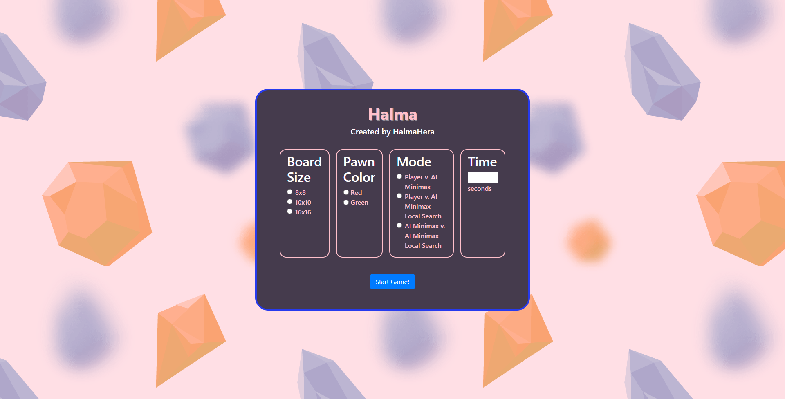
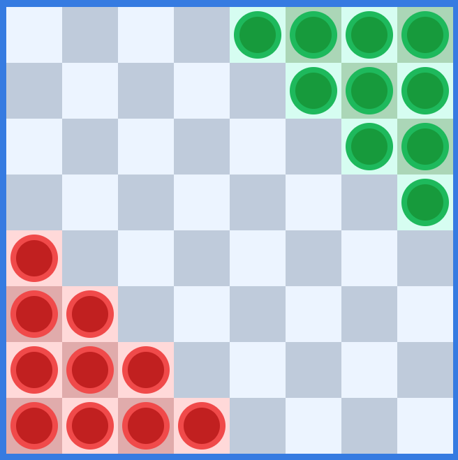
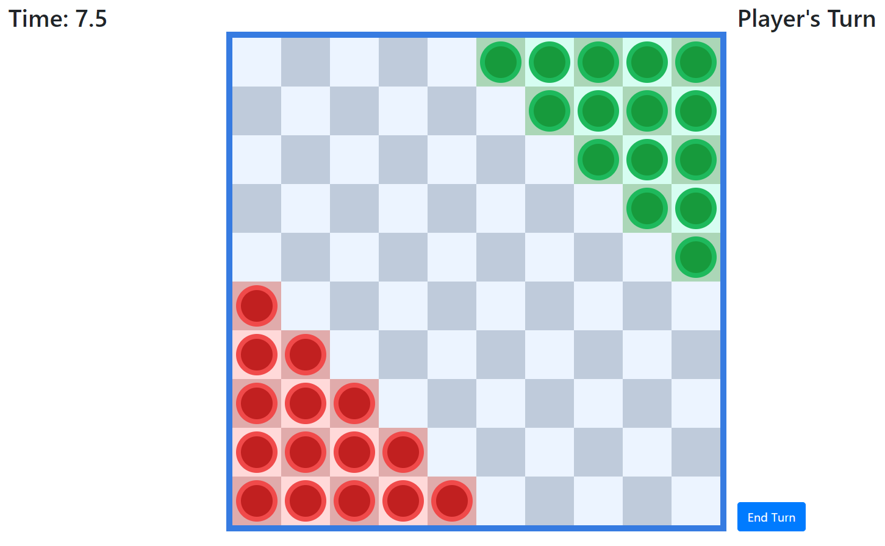
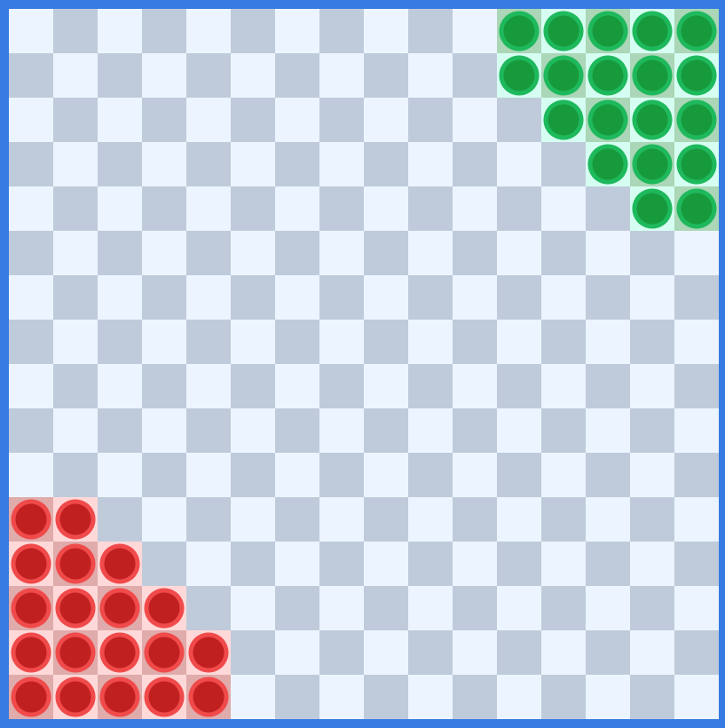

# Halma dengan Bot Minimax Algorithm & Alpha Beta Pruning

#### Aplikasi ini adalah sebuah permainan Halma 2 pemain, dengan lawan adalah sebuah bot. Bot menggunakan algoritma Minimax yang dilengkapi dengan Alpha Beta Pruning untuk mencari solusi. Selain itu terdapat juga pilihan bot dengan algoritma tambahan Local Search. Aplikasi juga dapat dijalankan dengan kedua bot yang saling berlawanan.

## Table of content

- [**How To Run**](#how-to-run)
- [How To Play](#how-to-play)
- [Built With](#built-with)
- [Contributor](#contributor)

## How To Run

Untuk memulai program, bukalah file index.html pada browser pilihan Anda.
Untuk memulai permainan:

1. Pilih ukuran papan yang ingin digunakan untuk bermain.
2. Pilih warna bidak yang ingin digunakan untuk bermain.
3. Pilih mode permainan. Pada mode "AI Minimax v. AI Minimax Local Search", Anda hanya bisa menonton perlawanan 2 bot.
4. Tentukan batas waktu tiap giliran.
5. Klik "Start Game!" untuk memulai permainan sesuai konfigurasi yang telah dipilih.
   Untuk mengulang permainan, Anda bisa melakukan refresh page.

 

## How To Play

1. Permainan bersifat bergilir.
2. Satu giliran hanya boleh menggerakkan satu bidak.
3. Bidak hanya dapat berpindah satu kotak ke kotak kosong atau melompati bidak lain manapun. Bidak dapat melompati bidak lain secara bersambungan berkali-kali.
4. Bidak tidak dapat memasuki rumah asal setelah keluar dari rumah tersebut, dan tidak dapat meninggalkan rumah target setelah memasuki rumah tersebut.
5. Permainan dapat dilakukan antara manusia dengan bot maupun antara bot dengan bot.

### Cara menggerakan bidak:

1. Klik bidak yang ingin digerakkan
2. Klik tempat tujuan yang legal

Note: Jika bidak tidak bergerak setelah diklik walaupun gerakan legal, bidak dapat di klik untuk kedua kalinya. Cek juga console untuk memeriksa gerakan valid atau tidak.

## Built With

Aplikasi dibuat dengan:

- Vanilla HTML
- Vanilla CSS
- [JQuery](https://jquery.com/download/)

## Contributor

Program dibuat untuk memenuhi salah satu Tugas Besar IF3170 Intelegensi Buatan ITB. Adapun pembuat dari program ini adalah :

- Muhammad Cisco Zulfikar - 13518073
- Faris Muhammad Kautsar - 13518105
- Gregorius Jovan Kresnadi - 13518135
- Muhammad Fauzan Rafi Sidiq Widjonarto - 13518147
